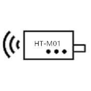

********************************
各国/地区的LoRaWAN频率计划和法规
********************************

`English <https://heltec-automation-docs.readthedocs.io/en/latest/general/index.html>`_



.. figure:: img/test/01.png


# Heltec Indoor Hotspot User Manual

```warning:: After the machine is connected to the network (either by inserting the network cable before the Helium APP connection, or after configuring the Wi-Fi through the Helium APP), it will start to update the firmware of the miner and start to synchronize the blockchain. If the power is cut off at this time, a system error may occur.

```

```warning:: Please press and hold the shutdown button to shut down. Direct power failure may damage the eMMC.

```

&nbsp;

## Activation process

Step 1: Download Helium APP through Apple Store / Google Play.


摘要
====

本文档仅是无线电法规的摘要，以及相应国家/地区应使用的适当频率计划。 这绝不是正式文件； 网关所有者仍然有义务查找，研究并遵守其本国的法规。 某些国家/地区还希望您注册网关或获取许可证。 在这种情况下，您使用的是“免费频段”，而不是“免许可频段”。 在某些国家/地区，如果您允许其他人也可以通过网关进行通信，则还必须经过网关认证（CE，FCC等）。

国家/地区
=========
A
-
+---------------------+------------------+--------------------------------------------------------------------------------------+
| Country/Region      | Frequency Plan   | Regulatory document                                                                  |
+=====================+==================+======================================================================================+
| Afghanistan         |                  |                                                                                      |
+---------------------+------------------+--------------------------------------------------------------------------------------+
| Albania             | EU863-870 EU433  | CEPT Rec. 70-03                                                                      |
+---------------------+------------------+--------------------------------------------------------------------------------------+
| Algeria             |                  | CONDITIONS D’UTILISATION DES EQUIPEMENTS D’IDENTIFICATION PAR RADIOFREQUENCES - RFID |
+---------------------+------------------+--------------------------------------------------------------------------------------+
| Andorra             | EU863-870 EU433  | CEPT Rec. 70-03                                                                      |
+---------------------+------------------+--------------------------------------------------------------------------------------+
| Angola              | EU863-870 EU433  | CRASA follows CEPT Rec. 70-03                                                        |
+---------------------+------------------+--------------------------------------------------------------------------------------+
| Antigua and Barbuda |                  |                                                                                      |
+---------------------+------------------+--------------------------------------------------------------------------------------+
| Argentina           | AU915-928        | RESOL-2018-581-APN-MM                                                                |
+---------------------+------------------+--------------------------------------------------------------------------------------+
| Armenia             |                  | EN 302 208                                                                           |
+---------------------+------------------+--------------------------------------------------------------------------------------+
| Australia           | AU915-928        |                                                                                      |
+---------------------+------------------+--------------------------------------------------------------------------------------+
| Austria             | EU863-870 EU433  | CEPT Rec. 70-03                                                                      |
+---------------------+------------------+--------------------------------------------------------------------------------------+
| Azerbaijan          | unknown, no CEPT | EN 302 208, CEPT Rec. 70-03                                                          |
+---------------------+------------------+--------------------------------------------------------------------------------------+

B
-
+------------------------+-----------------------+------------------------------------------------------------------------------------------------------------------+
| Country/Region         | Frequency Plan        | Regulatory document                                                                                              |
+========================+=======================+==================================================================================================================+
| Bahamas                |                       |                                                                                                                  |
+------------------------+-----------------------+------------------------------------------------------------------------------------------------------------------+
| Bahrain                | EU863-870 EU433       | Kingdom Of Bahrain National Frequency Plan                                                                       |
+------------------------+-----------------------+------------------------------------------------------------------------------------------------------------------+
| Bangladesh             |                       |                                                                                                                  |
+------------------------+-----------------------+------------------------------------------------------------------------------------------------------------------+
| Barbados               |                       |                                                                                                                  |
+------------------------+-----------------------+------------------------------------------------------------------------------------------------------------------+
| Belarus                | unknown, limited CEPT | CEPT Rec. 70-03                                                                                                  |
+------------------------+-----------------------+------------------------------------------------------------------------------------------------------------------+
| Belgium                | EU863-870 EU433       | CEPT Rec. 70-03                                                                                                  |
+------------------------+-----------------------+------------------------------------------------------------------------------------------------------------------+
| Belize                 |                       |                                                                                                                  |
+------------------------+-----------------------+------------------------------------------------------------------------------------------------------------------+
| Benin                  |                       |                                                                                                                  |
+------------------------+-----------------------+------------------------------------------------------------------------------------------------------------------+
| Bhutan                 |                       |                                                                                                                  |
+------------------------+-----------------------+------------------------------------------------------------------------------------------------------------------+
| Bolivia                | US902-928             |                                                                                                                  |
+------------------------+-----------------------+------------------------------------------------------------------------------------------------------------------+
| Bosnia and Herzegovina | EU863-870 EU433       | CEPT Rec. 70-03                                                                                                  |
+------------------------+-----------------------+------------------------------------------------------------------------------------------------------------------+
| Botswana               | EU863-870 EU433       | CRASA follows CEPT Rec. 70-03                                                                                    |
+------------------------+-----------------------+------------------------------------------------------------------------------------------------------------------+
| Brazil                 | AU915-928             | National Telecommunications Agency (ANATEL) Resolution No. 680, from June 27, 2017 - Portuguese only, Article 10 |
|                        |                       | National Telecommunications Agency (ANATEL) Act No. 14448, from December 4, 2017 - Portuguese only, Section 10.3 |
+------------------------+-----------------------+------------------------------------------------------------------------------------------------------------------+
| Brunei                 | AS923-925 (“AS2”)     |                                                                                                                  |
+------------------------+-----------------------+------------------------------------------------------------------------------------------------------------------+
| Bulgaria               | EU863-870 EU433       | CEPT Rec. 70-03                                                                                                  |
+------------------------+-----------------------+------------------------------------------------------------------------------------------------------------------+
| Burkina Faso           |                       |                                                                                                                  |
+------------------------+-----------------------+------------------------------------------------------------------------------------------------------------------+
| Burundi                |                       |                                                                                                                  |
+------------------------+-----------------------+------------------------------------------------------------------------------------------------------------------+

C
-
+----------------------------------+---------------------+--------------------------------------------------------------------+
| Country/Region                   | Frequency Plan      | Regulatory document                                                |
+==================================+=====================+====================================================================+
| Cabo Verde                       |                     |                                                                    |
+----------------------------------+---------------------+--------------------------------------------------------------------+
| Cambodia                         | AS923-925 (“AS2”)   |                                                                    |
+----------------------------------+---------------------+--------------------------------------------------------------------+
| Cameroon                         |                     |                                                                    |
+----------------------------------+---------------------+--------------------------------------------------------------------+
| Canada                           | US902-928           |                                                                    |
+----------------------------------+---------------------+--------------------------------------------------------------------+
| Central African Republic (CAR)   |                     |                                                                    |
+----------------------------------+---------------------+--------------------------------------------------------------------+
| Chad                             |                     |                                                                    |
+----------------------------------+---------------------+--------------------------------------------------------------------+
| Chile                            | AU915-928           | FIJA NORMA TECNICA DE EQUIPOS DE ALCANCE REDUCIDO                  |
+----------------------------------+---------------------+--------------------------------------------------------------------+
| China                            | CN470-510 CN779-787 |                                                                    |
+----------------------------------+---------------------+--------------------------------------------------------------------+
| Colombia                         | US902-928           |                                                                    |
+----------------------------------+---------------------+--------------------------------------------------------------------+
| Comoros                          |                     |                                                                    |
+----------------------------------+---------------------+--------------------------------------------------------------------+
| Democratic Republic of the Congo | EU863-870 EU433     | CRASA follows CEPT Rec. 70-03                                      |
+----------------------------------+---------------------+--------------------------------------------------------------------+
| Republic of the Congo            |                     |                                                                    |
+----------------------------------+---------------------+--------------------------------------------------------------------+
| Costa Rica                       | US902-928           |                                                                    |
+----------------------------------+---------------------+--------------------------------------------------------------------+
| Cote d’Ivoire                    |                     |                                                                    |
+----------------------------------+---------------------+--------------------------------------------------------------------+
| Croatia                          | EU863-870 EU433     | CEPT Rec. 70-03                                                    |
+----------------------------------+---------------------+--------------------------------------------------------------------+
| Cuba                             |                     |                                                                    |
+----------------------------------+---------------------+--------------------------------------------------------------------+
| Curacao                          |                     | Ministeriële regeling vrijstelling telecommunicatiemachtiging 2015 |
+----------------------------------+---------------------+--------------------------------------------------------------------+
| Cyprus                           | EU863-870 EU433     | CEPT Rec. 70-03                                                    |
+----------------------------------+---------------------+--------------------------------------------------------------------+
| Czech Republic                   | EU863-870 EU433     | CEPT Rec. 70-03                                                    |
+----------------------------------+---------------------+--------------------------------------------------------------------+

D
-
+--------------------+-----------------+---------------------+
| Country            | Frequency Plan  | Regulatory document |
+====================+=================+=====================+
| Denmark            | EU863-870 EU433 | CEPT Rec. 70-03     |
+--------------------+-----------------+---------------------+
| Djibouti           |                 |                     |
+--------------------+-----------------+---------------------+
| Dominica           |                 |                     |
+--------------------+-----------------+---------------------+
| Dominican Republic | US902-928       |                     |
+--------------------+-----------------+---------------------+

E
-
